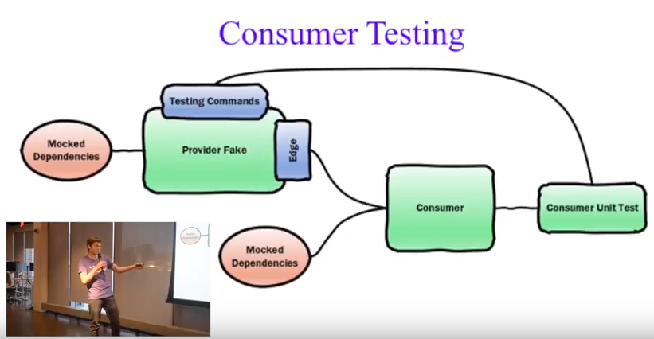

NOTICE: SUPPORT FOR THIS PROJECT ENDED ON 18 November 2020

This projected was owned and maintained by Jet.com (Walmart). This project has reached its end of life and Walmart no longer supports this project.

We will no longer be monitoring the issues for this project or reviewing pull requests. You are free to continue using this project under the license terms or forks of this project at your own risk. This project is no longer subject to Jet.com/Walmart's bug bounty program or other security monitoring.

## Actions you can take

We recommend you take the following action:

  * Review any configuration files used for build automation and make appropriate updates to remove or replace this project
  * Notify other members of your team and/or organization of this change
  * Notify your security team to help you evaluate alternative options

## Forking and transition of ownership

For [security reasons](https://www.theregister.co.uk/2018/11/26/npm_repo_bitcoin_stealer/), Walmart does not transfer the ownership of our primary repos on Github or other platforms to other individuals/organizations. Further, we do not transfer ownership of packages for public package management systems.

If you would like to fork this package and continue development, you should choose a new name for the project and create your own packages, build automation, etc.

Please review the licensing terms of this project, which continue to be in effect even after decommission.

ORIGINAL README BELOW

----------------------

# Microservice Edge Testing Demo

This repo is meant to be a sample implementation of a proposed pattern for
testing the edges between microservices. This implementation illustrates the
approach we are taking at Jet.com to answer the call spelled out in
**[this blog post](https://randalldavis.github.io/microservice/testing/edge/2017/06/14/edge-testing-solution.html)**.
This is meant to address the issue that the blog post calls out: __*non-vanilla
interactions between microservices are not being adequately tested in
microservice architectures*__.

For a talk that gives an overview of this concept, click the image below:

Note that this repo has code that is intentionally simplified to allow for more
focus on the recommended patterns for edge testing and how they might play out
in a real code base.

## Code Overview

This repo is just a sample to work through some of the real life patterns and
issues that would arise in microservice edge testing. This hypothetical code's
intent is to simulate one microservice which acts as a store for product data
and prices, and another which has some logic for deciding when and how to change
some of those values.

Below is a brief walkthrough of the code so that the important concepts can be
discussed without stumbling through the code. This walkthrough will address the
parts of the code that are standard and expected - the patterns that are unique
to this code sample will be covered in more depth afterward.

### Producer

The producer in this solution is a microservice that is in charge of storing and
updating the current state for different products (which are referred to by
unique identifiers called "sku"s). This producer is implementing the
distributable edge and edge fake pattern, and is the main focus of the repo.

#### Types

A good place to start is in `Producer.Domain.Types`. This file defines any types
that both the producer and the consumer of the service will care about.
Obviously, this means the types that the producer expects for requests, and the
return types. Also, this contains the signatures for all the functions the
producer will implement.

#### Logic

The actual producer starts implementing things in `Producer.Logic`. This is a
place for any complicated business logic, computations, or decision making. In
this scenario, the logic functions take in all the information they need, and
emit a result which contains any results, or what stateful changes need to be
made.

#### Controllers

In `Producer.Server`, the file `Controller.fs` contains the controllers for all
endpoints that actually have control over all that endpoints operations. For
example, for `HandleUpdateQuantity` it calls the buisiness logic to figure out
which action to take, and if it is determined an item needs to be updated, it
handles that.

#### Producer Production Style Wire Up

In `Program.fs`, the actual microservice is initialized, simply listening on
rest endpoints calling the controllers, or listening on a kafka topic for
messages and passing them along. Since everything is depenency injected in
controllers & buisiness logic, this is also where the database / upstream
services would have to be injected.

### Databases / Upstream Services

For every Database / Upstream service, the API to interact with it is definied
in the domain types. There are two simple passthrough classes defined, each
implementing this interface for a database. Also, the mocked database is
purposefully seeded with different data to simulate a dev and QA/prod
environment with different data.

### Producer Edge

The `ProducerEdge` simply implements the client facing interface defined in our
domain.types, and passes whatever it was given over the correct protocols for
the server to recieve them. This is the libraryThis also means that everything
must be abstracted so that the client sees things in a protocol agnostic way,
for example HTTP turns into just an async response, so the client never has to
deal with whatever internal protocol is used for the client -> producer
communication.

### Client

The client is a simple consumer of the producer microservice, which decides when
quantities or prices of items might need to change. Nothing is too novel on the
client side. It simply initializes the real edge, then runs whatever it would
normally run in production. For unit testing, it simply uses the faked edge to
allow for more stable tests and an easy way to bypass the complications testing
against a live kafka install.

### Standard Unit Tests

Standard unit tests are still possible and viable with this approach. In the
`ProducerTests` project there are standard unit tests that test individual
functions and bits of logic from the producer.

### Getting the Code to Run

#### Database

The initial database is seeded from a json file, located at
`edge-demo\Producer.Server\bin\Debug\database.json`, and this file will be
modified as the database is modified simulating a real mutable DB.

To initialize it, or to reset the database if you do not like your mutations,
copy the supplied `database.json` from this directory to the specified location.

#### Kafka

Kafka is run through docker, a simple `docker-compose up` should spin up the
kafka instance for you, use `docker-compose ps` to make sure both images are
running, then simply create a cluster with `kafkaserver` as the zookeeper host
and create topics for `priceupdate-topic` and `stateupdate-topic` through the
webui at `localhost:9000`.

If you are running this in a windows VM through parallels, make sure to enable
nested virtualization in parallels, and that you allocate the VM 8192 MB of RAM.
Less or More than that seems to casu.

## Edge Testing Components and Practices

Here's the important stuff. The
**[blog post](https://randalldavis.github.io/microservice/testing/edge/2017/06/14/edge-testing-solution.html)**
referenced above goes into Jet.com's approach to solving the problem with
microservice testing. This repo is meant to be a practical example of that
solution.

The blog post states: __*The provider microservice edge should ship along with
an intelligent fake that expresses the provider’s behaviors. The consumer
microservice should use that fake to exercise its non-vanilla interactions with
the provider.*__

### Provider Fake

Now, since we are giving the client a way to talk to the real producer with a
well defined business interface we can easily ship another edge to the consumer
that has a self contained faked out version of the producer. The
`ProducerEdgeFake` does just that. This behavior does not have to be production
ready or able to handle load, but it should be a mimic of all the producer's
behaviors and subtle nuances. In this case we were able to even include some of
the core business logic from the real producer, but this won't always be
possible.

### Provider Edge Testing

In addition to just doing the normal, targeted, smaller unit tests focused on
individual functions, the provider also tests the entire result of calling the
functions exposed on its edge. These test the sum of the entire functionality of
the provider including how the bits of business logic are wired together.

To call the producer we use simple passthrough edge that calls the controllers
of the producer directly, defined in the `DirectEdge` project. using this, on
every test run, we run the testing function against both the fake and actual
code to make sure the functionality of the fake stays in parity with the real
production version of the code. The simple helper defined in `Helpers.fs` is
what we pass every testing function into, which runs the test against both edges
and reinializes the fake db every test so tests are always starting from a known
state independent of the other tests, so we can run as many of these in parallel
as we want.

### Consumer Testing

The client uses only the producer edge fake for unit tests, which like in the
producer ensures that there is a version of the producer starting from a given
state with a self contained database / external dependencies, with a small
mocked-out codebase that runs entirely in memory on the consumers side. Another
big win is that since the producer fake is self contained on the consumer's
side, the consumer never has any dependencies on some kafka broker or extenal
service being up during testing, but due to the defined interface is aware of
all the functionality and can make sure its tests align with how the producer
actually does run.

### Testing Commands

Finally we get to the testing commands, the entire purpose for this whole setup.
By reimplementing the controller, we can expose an interface for the client to
tweak the fake's behavior to simulate different states or levels of degraded
performance that the producer might encounter in production. For example, here
we implemented methods to simulate the producer's database being down or
unreachable. This allows clients to test against not just the expected results,
but edge cases and errors that the producer might throw to the client in
production.
